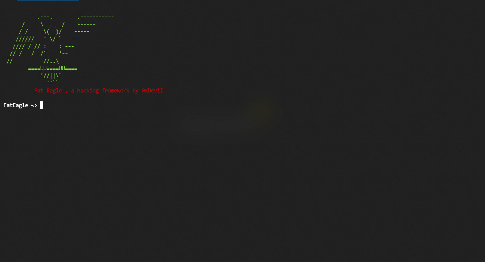

# Fat Eagle
a hacking and cybersecurity framework

&nbsp;
<center></center>

&nbsp;
### Description
*Fat Eagle* is a hacking and cybersecurity framework written in python.
you can easily run it everywhere like windows,linux,mac,android and everywehere python can run. with this framework you can access to top
security tools like exploits,payloads,hash crackers,phishing tools and
e.t.c.

&nbsp;
### How to install
```bash
git clone https://github.com/0xDeviI/FatEagle.git
cd FatEagle
python3 -m pip install -r requirements.txt
```

&nbsp;
### New Features (Version 1.7 Alpha)
new features added to version 1.6 Alpha
- new FeScript (IPRS, ShutSH, Fu*kTP)
- bug fixes

&nbsp;
### How to use
You can easily run framework by this command
```bash
python3 fEagle.py
```
*Note: if you just installed python3 on your machine, type 'python' instead python3 to run framework.*

&nbsp;
### Primary Commands
framework uses some Primary commands.
Primary commmands are:
- search [FeScript]:             search module
- funsearch [Function]:          search a function
- load [FeScript|Module]:      load module
- unload module:    unload module
- myIP:               show IP address of user
- myHost:             show user host name
- clear/cls:          clear screen(different in windows and others)
- banner:             show random banner
- update mdb:          update module database(require if new module added)
- update fundb:        update function database(require if new function added)
- exit:               exit framework
- deltemp:            delete module's temp files
- version:            show framework version
- fwi:                show info of framework
- call [Function] [Args]        run a single function
- exec [shell]        execute an os shell

FeScripts uses some commands to config and run, FeScript commands are:
- fesOptions:         show all available switch in module
- fesRequire:         show all required switch in module
- fesInfo:            show info about module
- fesHelp:            show help that module author writted
- show [switch]:       show value of a switch
- fesStart:           start a fescript
- set [switch] [value]: set a value for a switch
Also framework uses some commands to config and run FeScript lists, FeScript list commands are:
- add [FeScript] [ListName]:                add a module to custom lists
- show list [ListName]:          show custom list
- info [ListName]:               show info modules in  custom list
- start:              start custom list
- mset [Property] [Value] [FeScript]:               set value to custom module in custom list

&nbsp;
### Configuration
You can easily config framework using file 'feConfig.py'. for example you can disable modules database update in startup by this setting:
```python
MODULE_DB_UPDATE_ON_START = False
```

### LICENSE
here is MIT [License](LICENSE)